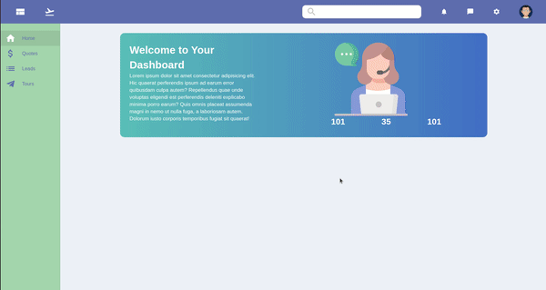
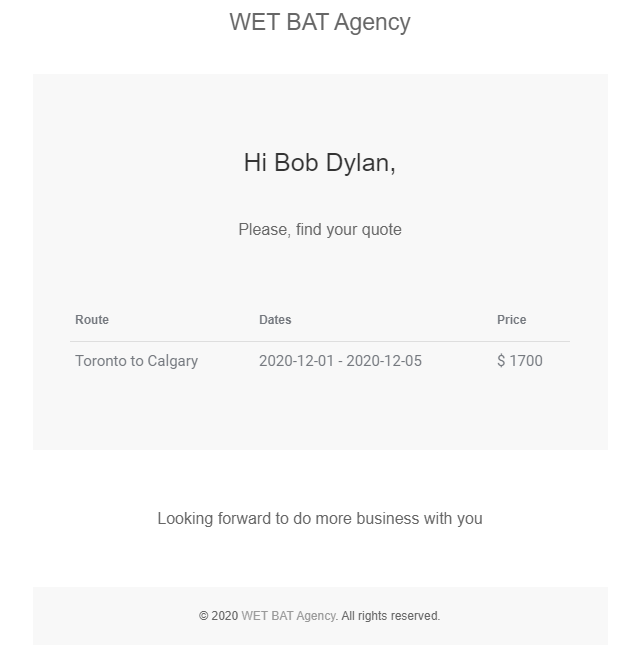
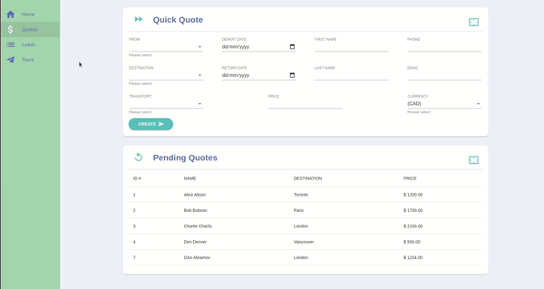

## WET BAT World Adventure

### Available Scripts

In the project directory, you can run:

### ▶️ Clone this repo and run:

#### `cd express-app` and `npm start`

#### `cd react-app` and `npm start`

Runs the app in the development mode. 
Open [http://localhost:3000](http://localhost:3000) to view it in the browser.

### Elephant SQL database reset

1. `cd express-app`
2. `npm run db:reset`

### .env setup

1. Create an `.env` file based on `.env.example`
2. If user/database info during PSQL setup was changed, make sure that the information in the `.env` match

### Features

1. Create Quote.
   

2. Email Confirmation
   

3. Edit Quote.
   
